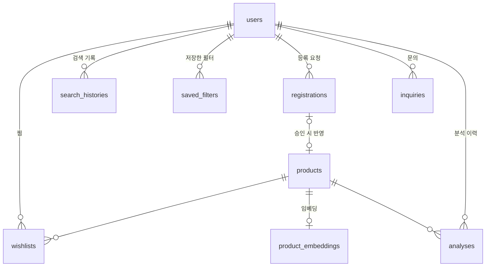

# FIRST LABEL — DB 스키마

- 원본: `backend/app/core/db.py` (SQLAlchemy 모델)
- 실행용 DDL: `supabase/schema.sql` — `python scripts/dump_schema.py` 로 모델에서 자동 생성
- 코드와 DDL이 어긋날 수 없도록 **모델 하나만 고치고 다시 생성**하면 됩니다.

Supabase 적용: 대시보드 → SQL Editor 에 `supabase/schema.sql` 붙여넣고 실행.
(FastAPI는 `DATABASE_URL` 이 있으면 기동 시 없는 테이블을 자동 생성하므로, SQL 실행은 선택입니다.)

---

## 초안 ERD에서 고친 것

| 항목 | 초안 | 수정 | 이유 |
|---|---|---|---|
| `users.user_id` | `uuid` + AUTO_INCREMENT | `uuid DEFAULT gen_random_uuid()` | Postgres엔 AUTO_INCREMENT가 없음 |
| 자식 테이블 `user_id` | `bigint` | `uuid` | 부모가 uuid라 타입이 맞지 않으면 **FK 생성 자체가 실패** |
| `users.user_email` | `text UNIQUE` | `login_id text UNIQUE` | 시안은 이메일을 받지 않음. 아이디 기반 로그인, 소셜 로그인 없음 |
| `users.name` | `text` | `nickname` | 시안 회원가입 항목이 닉네임 |
| `users` | — | `deleted_at` 추가 | §8 회원 탈퇴가 소프트 삭제 방식 |
| `users` | — | `notify_*` 5개 추가 | 마이페이지 알림 설정 화면 |
| `products.calories` | `NOT NULL` | `DEFAULT 0` | 미등록 제품 등록 시 칼로리를 모름 |
| `products.raw_materials` | `jsonb NOT NULL` | `raw_ingredients text` | OCR은 원문 텍스트를 주고, 분할은 분석 단계에서 수행 |
| `products` | — | `volume`, `image_url`, `image_source`, `rating`, `rating_count`, `is_lactose_free`, `is_plant_based` 추가 | 시안 카드/추천 탭이 이 값들로 동작 |
| "users 1:N products" | 관계만 표기 | **삭제** | `products`에 `user_id`가 없어 성립하지 않음. 사용자가 올린 제품은 `registrations` 로 추적 |
| 테이블 | 4개 | **9개** | `registrations`, `inquiries`, `saved_filters`, `analyses`, `product_embeddings` 추가 |
| 타임스탬프 | `timestamptz` | 유지 ✓ | 좋은 선택 |
| `wishlists` UNIQUE, `search_histories` 인덱스 | 있음 | 유지 ✓ | 그대로 씀 |

`products`에 `user_id`를 두지 않은 이유: 탈퇴해도 등록된 제품은 공용 데이터로 서비스에 남아야 하기 때문입니다(§8). 등록자 추적은 `registrations.user_id`가 담당하고, 탈퇴 시 이 값만 `NULL`로 끊습니다.

---

## 테이블 관계



## 테이블 요약

| 테이블 | PK | 역할 |
|---|---|---|
| `users` | `user_id uuid` | 회원. 소프트 삭제(`deleted_at`) + 알림 설정 |
| `products` | `product_id bigserial` | 제품 마스터 |
| `product_embeddings` | `embedding_id bigserial` | 제품 임베딩 벡터 (pgvector) |
| `wishlists` | `wishlist_id bigserial` | 찜. `UNIQUE(user_id, product_id)` |
| `search_histories` | `search_id bigserial` | 최근 검색어 |
| `saved_filters` | `id bigserial` | 저장한 성분 필터 |
| `registrations` | `id bigserial` | 미등록 제품 등록 요청 |
| `inquiries` | `id bigserial` | 1:1 문의 |
| `analyses` | `id bigserial` | 분석 이력 (마이페이지 "분석한 제품" 카운트) |

---

## product_embeddings

```sql
embedding_id  bigserial primary key,
product_id    bigint  references products(product_id) on delete cascade,
source        varchar(30)  -- 무엇을 임베딩했는지: raw_ingredients | name | name_ingredients
model         varchar(60)  -- 예: text-embedding-3-small
dim           integer,
embedding     vector(1536),
created_at    timestamptz default now(),
unique (product_id, model)
```

- 차원은 `backend/app/core/db.py` 의 `EMBEDDING_DIM` 하나만 바꾸면 DDL까지 따라옵니다.
- `unique (product_id, model)` — 같은 제품에 대해 모델별로 한 벡터씩 보관(모델 교체 시 무중단 마이그레이션 가능).
- ANN 인덱스는 데이터가 어느 정도 쌓인 뒤 만드는 게 좋습니다(`schema.sql` 마지막에 HNSW 인덱스 포함).

유사 제품 검색 쿼리:

```sql
select p.*, 1 - (e.embedding <=> :query_vec) as similarity
from product_embeddings e
join products p on p.product_id = e.product_id
where e.product_id <> :base_id
order by e.embedding <=> :query_vec
limit 5;
```

> **현재 상태:** 테이블과 인덱스는 만들어져 있지만 **아직 채우는 코드는 없습니다.**
> 지금 추천 API(`/api/v1/products/{id}/recommendations`)는 원재료 집합의 자카드 유사도로 동작합니다.
> 임베딩을 쓰려면 (1) 임베딩 생성 배치, (2) 추천 쿼리를 위 SQL로 교체 — 두 가지가 필요합니다.
