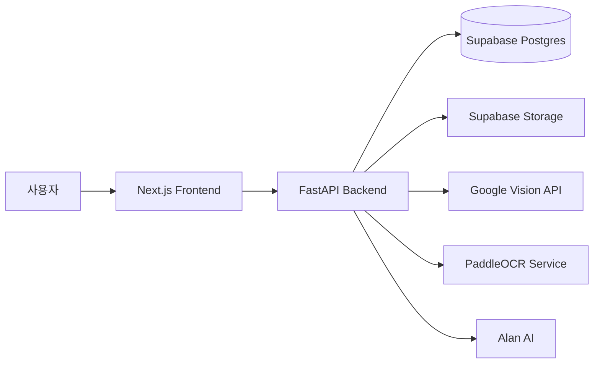
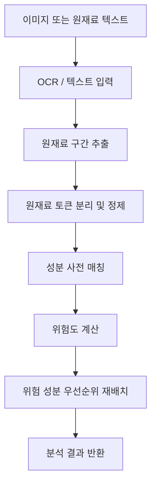

# Architecture

FIRST LABEL은 프론트엔드, FastAPI 백엔드, 데이터베이스/스토리지, OCR 경로를 분리한 구조입니다.



## Frontend

- 위치: `frontend/`
- 기술: Next.js, TypeScript, Tailwind CSS
- 역할:
  - 홈/검색
  - 제품 분석 결과
  - 대체 제품 추천
  - OCR 분석 화면
  - 미등록 제품 등록
  - 로그인/회원가입
  - 마이페이지

프론트엔드는 `NEXT_PUBLIC_API_BASE`를 통해 백엔드 API 주소를 참조합니다.

## Backend

- 위치: `backend/`
- 기술: FastAPI, SQLAlchemy
- 역할:
  - 인증
  - 제품 검색 및 상세
  - 성분 분석
  - 추천
  - 찜
  - 등록 요청
  - 사용자/마이페이지 기능
  - OCR 연동
  - 이미지 저장

API는 `/api/v1/...` 경로로 통일되어 있습니다.

## 데이터베이스

운영 환경에서는 Supabase Postgres를 사용하고, `DATABASE_URL`이 없으면 로컬 SQLite로 동작합니다.

주요 테이블은 사용자, 제품, 찜, 검색 이력, 저장 필터, 등록 요청, 문의, 분석 이력 등으로 구성됩니다.

자세한 관계는 [Database](./Database.md)를 참고하세요.

## 이미지 저장

제품 등록 시 업로드된 이미지는 다음 순서로 처리됩니다.

1. Supabase Storage가 설정되어 있으면 Storage 사용
2. 설정되지 않은 로컬 환경에서는 `backend/uploads/` 사용

## OCR

OCR은 환경 설정에 따라 여러 경로를 사용할 수 있습니다.

```text
Google Vision API
        ↓ 미설정
원격 PaddleOCR 서비스
        ↓ 미설정
로컬 PaddleOCR
```

서버리스 환경에서는 PaddleOCR 패키지 용량 문제 때문에 Google Vision 또는 별도 OCR 서비스를 사용하는 구성이 적합합니다.

## 성분 분석 흐름



분석 엔진에 대한 자세한 내용은 [Ingredient Analysis](./Ingredient-Analysis.md)를 참고하세요.

## 관련 코드

- `backend/app/main.py`
- `backend/app/api/`
- `backend/app/services/ingredients.py`
- `backend/app/services/ocr.py`
- `backend/app/services/storage.py`
- `backend/app/core/db.py`
- `frontend/lib/api.ts`
