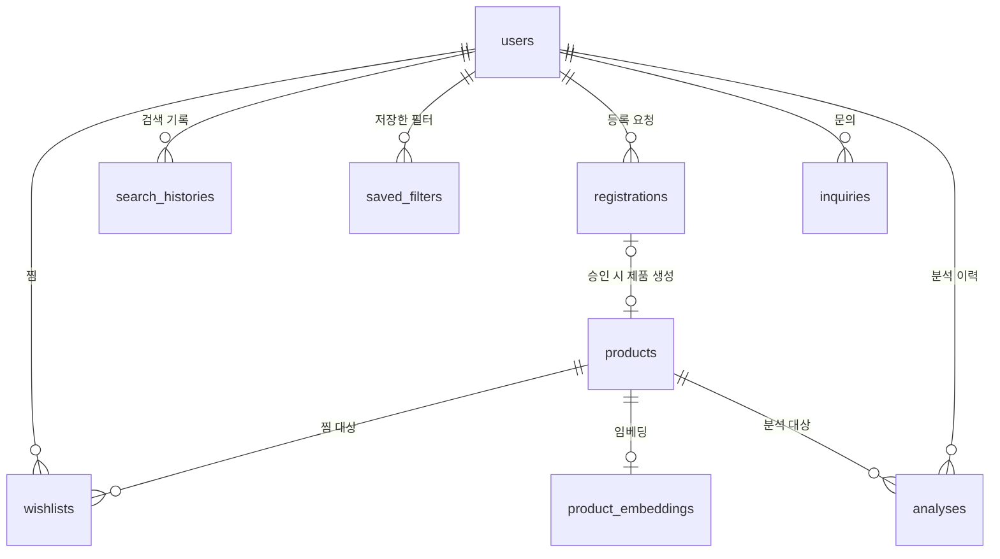

# Database

FIRST LABEL의 데이터베이스는 SQLAlchemy 모델을 기준으로 관리하며, 운영 환경에서는 Supabase Postgres를 사용합니다.

- 모델: `backend/app/core/db.py`
- SQL DDL: `supabase/schema.sql`
- 스키마 문서: `docs/SCHEMA.md`

## ERD



## 주요 테이블

| 테이블 | 역할 |
|---|---|
| `users` | 회원 정보와 알림 설정, 소프트 삭제 상태 관리 |
| `products` | 제품 마스터 데이터 |
| `product_embeddings` | 제품 임베딩 벡터 저장 |
| `wishlists` | 사용자별 찜 제품 |
| `search_histories` | 최근 검색 기록 |
| `saved_filters` | 사용자 정의 성분 필터 |
| `registrations` | 미등록 제품 등록 요청 |
| `inquiries` | 사용자 문의 |
| `analyses` | 사용자 분석 이력 |

## 사용자와 제품의 관계

`products`에는 `user_id`가 없습니다.

사용자가 등록 요청을 만들더라도 최종 승인된 제품은 서비스의 공용 데이터가 되기 때문입니다. 등록자를 추적할 필요가 있는 동안에는 `registrations.user_id`를 사용하고, 회원 탈퇴 시에는 이 연결만 끊습니다.

## 회원 탈퇴

회원 탈퇴는 계정을 즉시 물리 삭제하지 않고 소프트 삭제 방식으로 처리합니다.

주요 처리:

- `users.deleted_at` 기록
- 로그인 ID, 닉네임, 비밀번호 정보 익명화
- 찜, 검색 기록, 저장 필터, 문의 삭제
- 등록 요청과 분석 이력은 `user_id`만 제거해 익명 데이터로 보존

## 제품 임베딩

`product_embeddings`는 향후 벡터 기반 유사 제품 추천을 위해 준비된 테이블입니다.

현재 추천 API는 원재료 집합의 유사도를 기준으로 동작하며, 임베딩 테이블을 채우는 배치 로직은 아직 구현되어 있지 않습니다.

향후 벡터 검색을 적용하려면 다음 작업이 필요합니다.

1. 제품 텍스트 임베딩 생성
2. `product_embeddings` 저장
3. 현재 추천 알고리즘을 pgvector 검색으로 교체

## 스키마 변경 방법

SQLAlchemy 모델을 수정한 뒤 아래 스크립트를 실행해 SQL 파일을 갱신합니다.

```bash
python scripts/dump_schema.py
```

Supabase에 직접 적용하려면 SQL Editor에서 `supabase/schema.sql`을 실행합니다.

> DB 구조의 상세 필드와 설계 변경 이력은 [`docs/SCHEMA.md`](../SCHEMA.md)를 기준으로 확인합니다.
