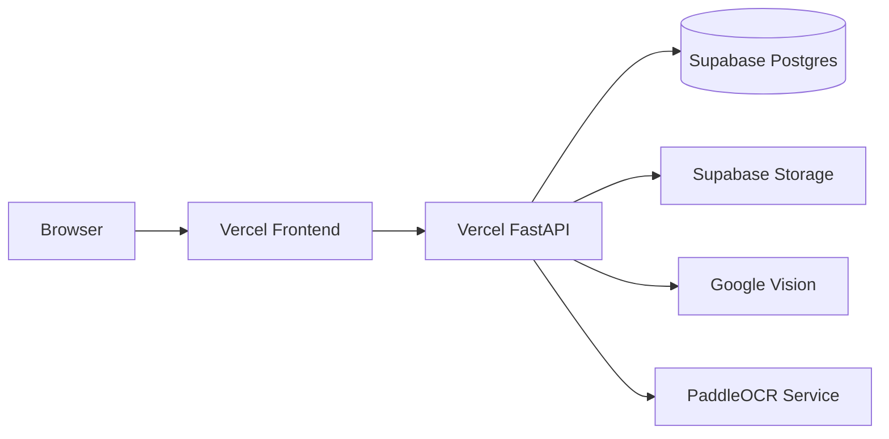

# Deployment

FIRST LABEL은 프론트엔드, FastAPI 백엔드, 데이터베이스/스토리지, OCR을 각각 분리해서 배포할 수 있습니다.

## 구성



## Frontend

프론트엔드는 Vercel 배포를 기준으로 구성되어 있습니다.

환경 변수:

```env
NEXT_PUBLIC_API_BASE=https://<backend-domain>
```

## Backend

FastAPI는 `backend/api/index.py`를 서버리스 진입점으로 사용합니다.

운영 환경에서는 최소한 다음 설정을 확인해야 합니다.

```env
DATABASE_URL=...
JWT_SECRET=...
CORS_ORIGINS=...
```

`JWT_SECRET`은 개발용 기본값에 의존하지 않고 운영 환경에서 별도로 설정하는 것을 권장합니다.

## Supabase Database

`DATABASE_URL`에 Supabase Postgres 연결 문자열을 지정합니다.

스키마 적용 방법은 두 가지입니다.

1. 서버 기동 시 SQLAlchemy 모델을 기준으로 필요한 테이블 생성
2. Supabase SQL Editor에서 `supabase/schema.sql` 실행

pgvector까지 사용할 계획이라면 SQL 파일을 직접 적용하는 방식이 더 명확합니다.

## Supabase Storage

제품 이미지를 영속 저장하려면 다음 값을 설정합니다.

```env
SUPABASE_URL=...
SUPABASE_SERVICE_KEY=...
SUPABASE_BUCKET=product-images
```

`SUPABASE_SERVICE_KEY`는 서버에서만 사용해야 하며 프론트엔드에 노출하면 안 됩니다.

## OCR

운영 환경에서 사용할 수 있는 경로는 세 가지입니다.

### 1. Google Vision

```env
GOOGLE_VISION_API_KEY=...
```

키가 설정되어 있으면 Google Vision을 우선 사용합니다.

### 2. 별도 PaddleOCR 서비스

```env
OCR_SERVICE_URL=https://<ocr-service>
OCR_API_KEY=...
```

백엔드와 OCR 서비스를 분리하면 서버리스 패키지 용량 문제를 피할 수 있습니다.

### 3. 로컬 PaddleOCR

Google Vision과 원격 OCR 서비스가 모두 설정되지 않은 로컬 환경에서는 PaddleOCR을 직접 실행할 수 있습니다.

```bash
pip install paddlepaddle paddleocr
```

## Health Check

백엔드 상태는 다음 API로 확인합니다.

```text
GET /api/v1/health
```

환경에 따라 DB, Storage, OCR 연결 상태를 확인할 수 있습니다.

## 배포 전 체크리스트

- 운영 `JWT_SECRET` 설정
- `CORS_ORIGINS` 운영 도메인으로 제한
- Supabase service_role 키 서버에만 저장
- Google Vision API Key 제한 설정
- OCR 서비스 인증 설정
- 이미지 업로드 용량 제한 확인
- `.env` 및 비밀키 Git 추적 여부 확인
- 프론트엔드 `NEXT_PUBLIC_API_BASE` 운영 URL 확인

보다 상세한 실제 연동 절차는 [`docs/SETUP.md`](../SETUP.md)를 참고하세요.
