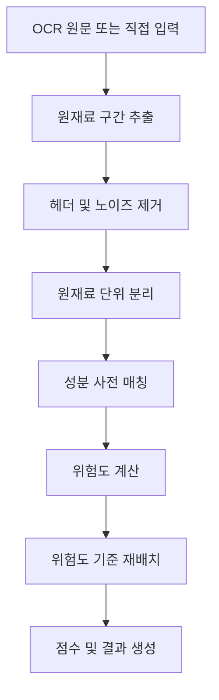

# Ingredient Analysis

FIRST LABEL의 핵심 기능은 원재료 텍스트를 분석해 유당 관련 주의 성분을 찾고, 위험도가 높은 성분을 먼저 보여주는 것입니다.

핵심 구현:

- `backend/app/services/ingredients.py`
- `backend/app/data/lactose_keywords.json`
- `backend/tests/test_ingredients.py`

## 처리 흐름



## 1. 원재료 구간 추출

라벨 전체 OCR 결과에는 제조사, 영양정보, 유통기한 같은 내용이 함께 들어올 수 있습니다.

분석 엔진은 `원재료명`, `성분명` 같은 시작 지점을 찾고 아래와 같은 문자열이 나오기 전까지를 원재료 영역으로 봅니다.

- 영양정보
- 제조원
- 판매원
- 유통기한 / 소비기한
- 보관방법
- 알레르기 / 주의사항

## 2. 원재료 분리

쉼표, 줄바꿈, 구분자 등을 기준으로 원재료를 분리합니다.

괄호 내부의 쉼표는 원산지나 세부 원료일 수 있기 때문에 단순 분리하지 않습니다.

예:

```text
원유(국산), 정제수, 탈지분유(국산)
```

→

```text
원유(국산)
정제수
탈지분유(국산)
```

OCR이 쉼표를 누락한 경우에는 공백 기반 보정 로직도 사용합니다.

## 3. 성분 사전 매칭

성분 사전은 `lactose_keywords.json`에서 관리합니다.

주요 그룹:

- `LACTOSE`: 유당 관련 성분
- `GENERAL`: 일반 주의 성분

각 항목에는 다음 정보가 포함됩니다.

- 대표 키워드
- alias
- 위험도
- 사용자에게 보여줄 설명

예를 들어 `탈지분유`, `전지분유`, `원유` 등은 높은 위험도로 분류되며, `유청`, `카제인` 계열은 별도 주의 단계로 분류됩니다.

## 4. 위험도

현재 위험도 우선순위:

```text
DANGER > WARNING > CAUTION > SAFE
```

분석 결과에서는 위험도가 높은 성분을 앞쪽으로 재배치합니다. 같은 위험도끼리는 기존 원문 순서를 유지합니다.

## 5. 점수

성분별 위험도에 패널티를 부여한 뒤 100점에서 차감합니다.

현재 패널티:

| 위험도 | 패널티 |
|---|---:|
| `DANGER` | 18 |
| `WARNING` | 10 |
| `CAUTION` | 4 |
| `SAFE` | 0 |

점수 라벨:

```text
85 이상 → 안심
60 이상 → 양호
60 미만 → 주의 필요
```

## 6. 결과 구조

분석 결과의 주요 필드:

- `has_warning`: 위험 성분 존재 여부
- `warning_count`: 강조 대상 수
- `score`: 종합 점수
- `score_label`: 점수 라벨
- `counts`: 위험도별 개수
- `first_card`: 화면 상단에 먼저 보여줄 성분
- `all_ingredients`: 위험도 순으로 재배치된 전체 성분
- `original_order`: 원래 순서의 전체 성분

## 테스트

핵심 로직 회귀 테스트:

```bash
cd backend
.venv/Scripts/python tests/test_ingredients.py
```

OCR 텍스트 분리, 위험 성분 재배치, 락토프리 처리, 점수 계산 등을 테스트합니다.

> 이 문서는 현재 구현을 설명하는 문서입니다. 분석 정확도와 예외 처리는 지속적으로 개선 대상이며, 실제 동작은 `ingredients.py`를 기준으로 확인합니다.
